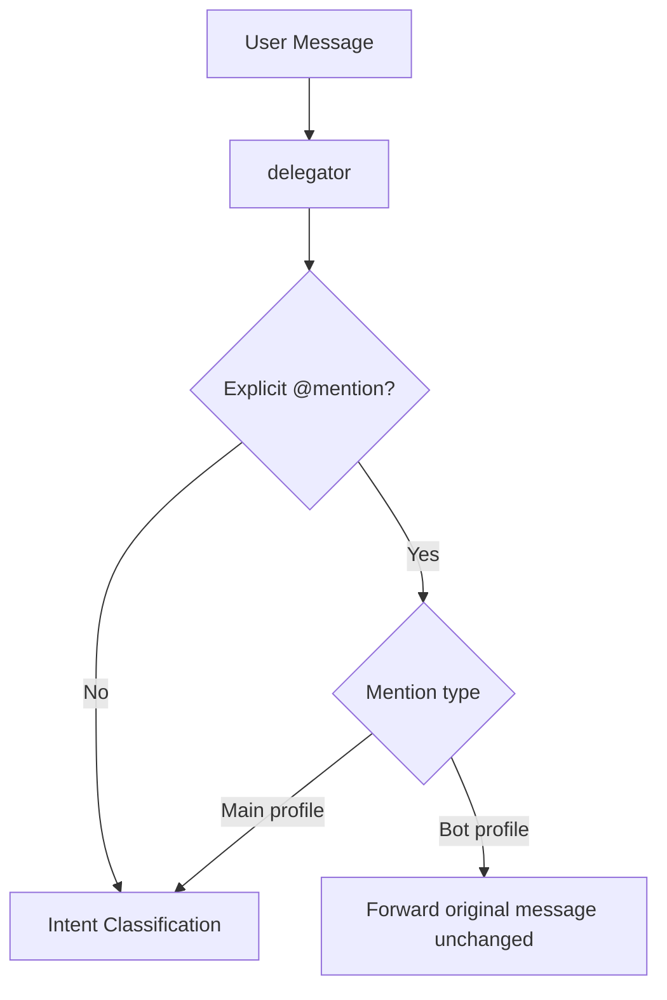
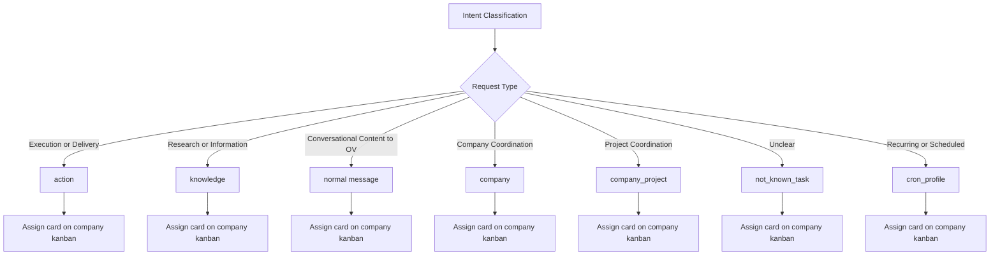
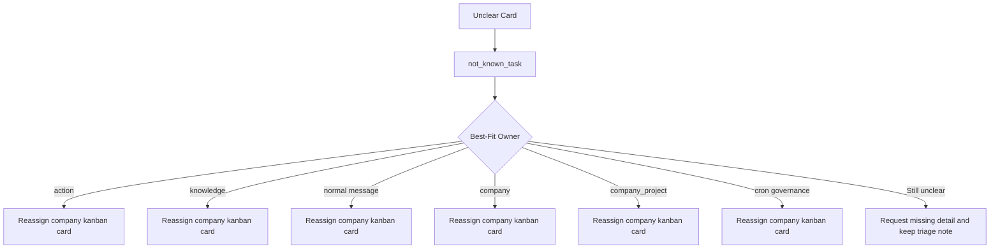
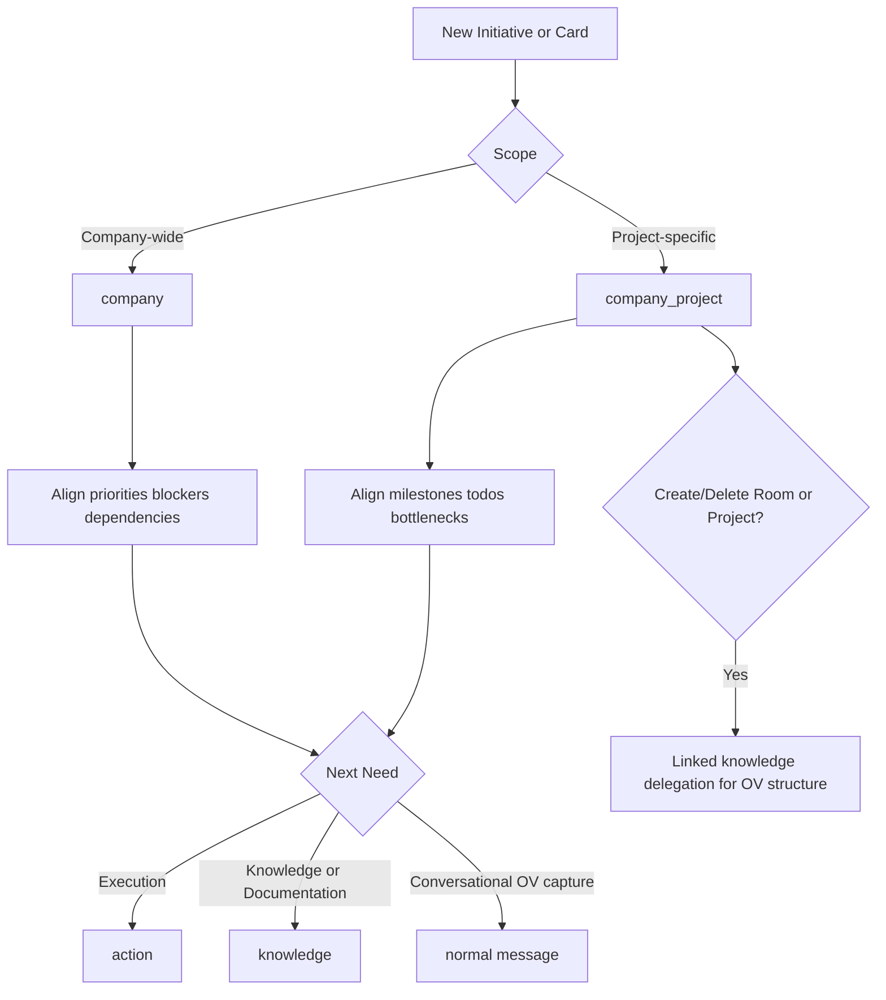
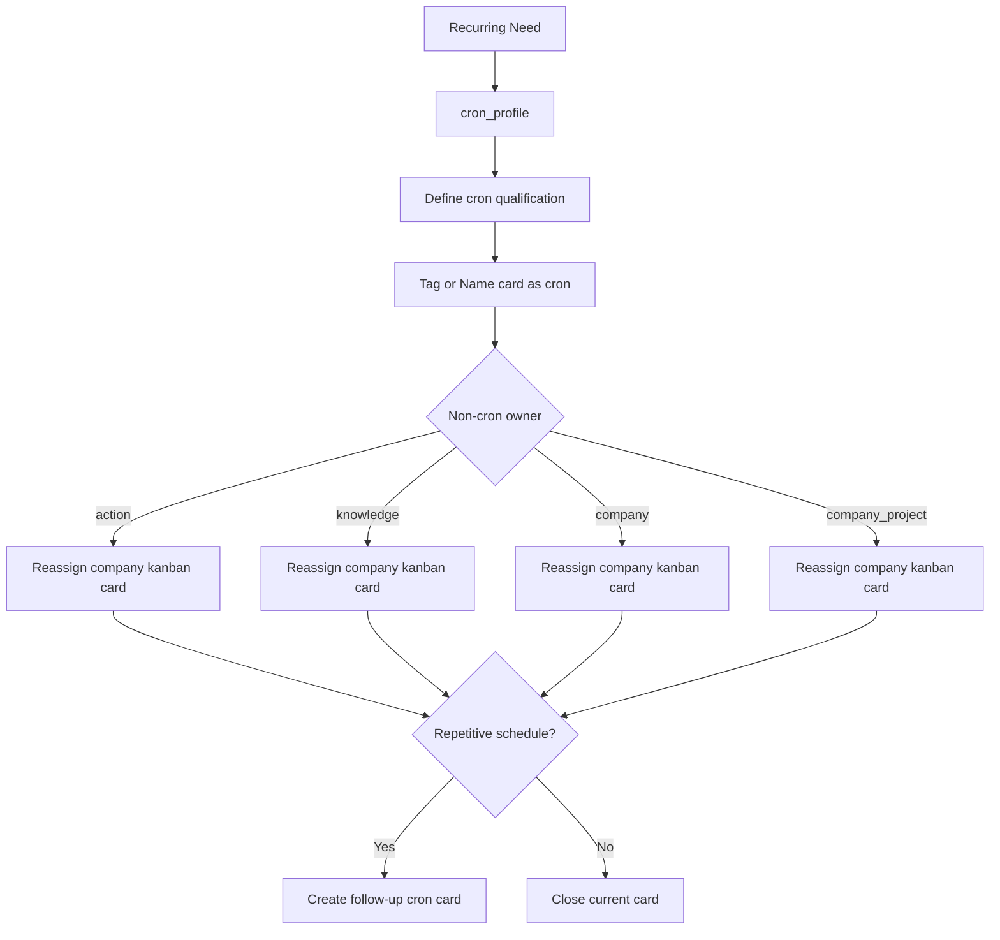
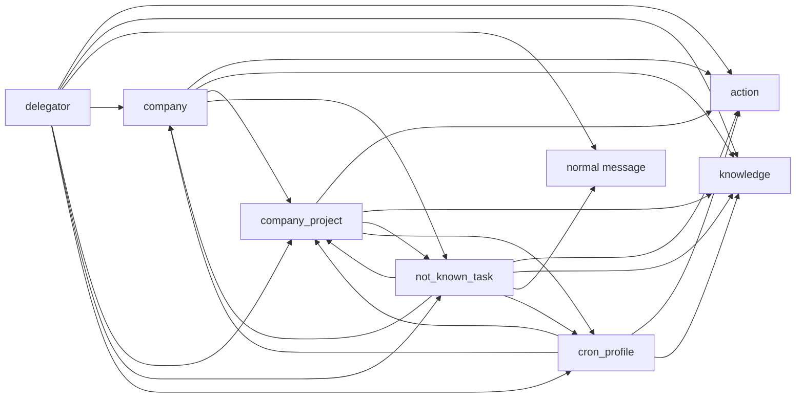
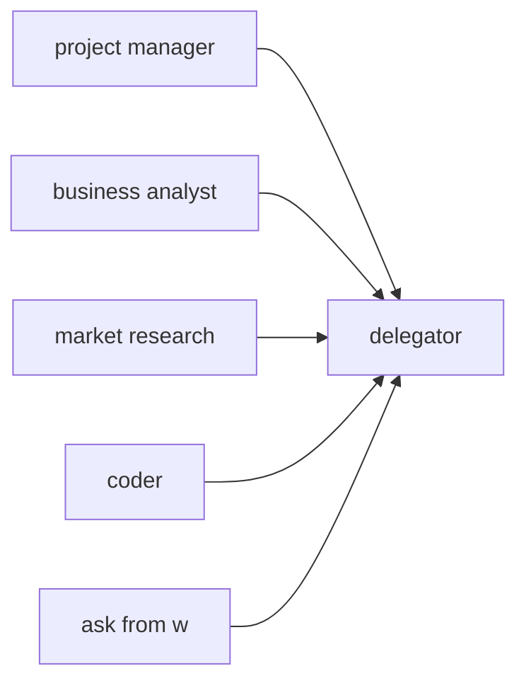

# Profile Workflows and Interactions

This document defines how profiles collaborate operationally.

## Core Interaction Rules

- Main profiles interact mostly through company kanban card assignment and reassignment.
- Explicit @mention passthrough is bot-only.
- Explicit @mention of main profiles is not a direct command.
- Cron work is delegated through kanban reassignment, not direct profile invocation.
- Room/project create-delete tasks include a linked knowledge delegation for OV structure consistency.

## Workflow 1: Entry and Mention Handling

## Workflow 2: Intent Classification and Kanban Assignment

## Workflow 3: Unclear Task Triage

## Workflow 4: Company and Project Coordination

## Workflow 5: Cron Card Lifecycle

## Workflow 6: Main Profile Interaction Graph

## Workflow 7: Bot Entry Points into Main Routing

## Notes

- normal message captures conversational content into OV and does not send direct user replies.
- knowledge uses Obsidian MCP for linked knowledge updates when available.
- Main-profile handoff should be represented as kanban card assignment/reassignment.
