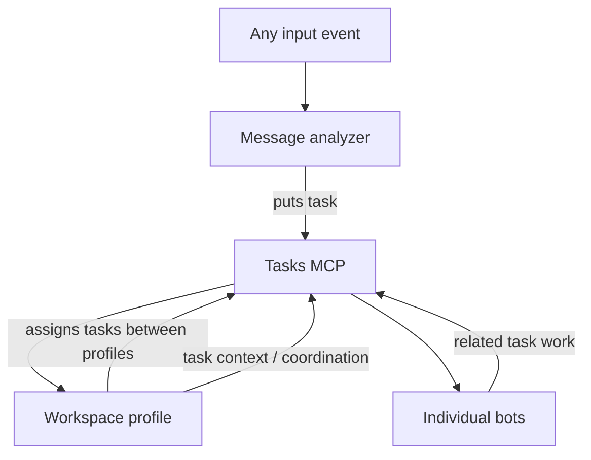

```mermaid
flowchart TD
    A["Any input event"] --> B["Message analyzer"]
    B -->|puts task| E["Tasks MCP"]
    E --> C["Workspace profile"]
    E --> D["Individual bots"]
    C -->|assigns tasks between profiles| E
    D -->|related task work| E
    C -->|task context / coordination| E
```

